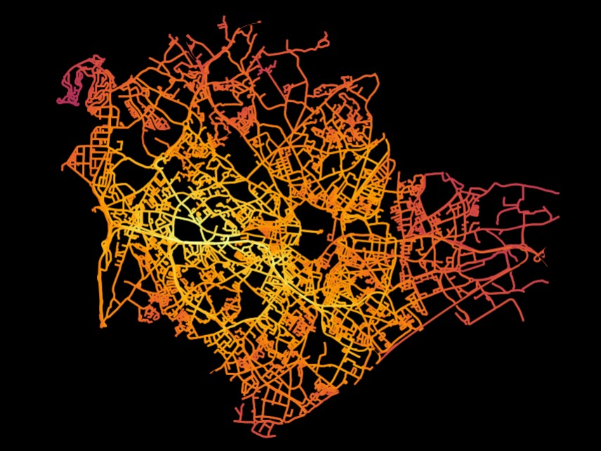

<p align="center">
  <strong> MONTPELLIER NETWORK </strong> <br>

</p>

This is a python package name montpellier_network, that has for goal to create a video and a widget showing a car, a pedestrian and a bicycle going from "La Maison du Lez" to "Place Eugène Bataillon" in Montpellier with the shortest path possible.

## Installation 
To install the package osmnx you can use this commands :
```{bash}
$ conda config --prepend channels conda-forge
$ conda create -n ox --strict-channel-priority osmnx
```
If you have any trouble with the installation, follow this [link](https://github.com/NREL/OpenOA/blob/master/readme.md)

## Use of osmnx package
Follow this link for [documentation](https://osmnx.readthedocs.io/en/stable/osmnx.html#module-osmnx.settings)

## Documentation 
To see the documentation of this package, you can go to the folder doc.

## More informations
For more information, follow this [link](https://github.com/gboeing/osmnx-examples)

## Contributing: 
This project is the result of many hours of work contributed freely by :  

    Sahbane Abdesstar : sahbane.abdesstar@gmail.com
    Fanchon Herman : fanchon.herman974@gmail.com
    Ryma Lakehal : ryma.lakehal@etu.umontpellier.fr
